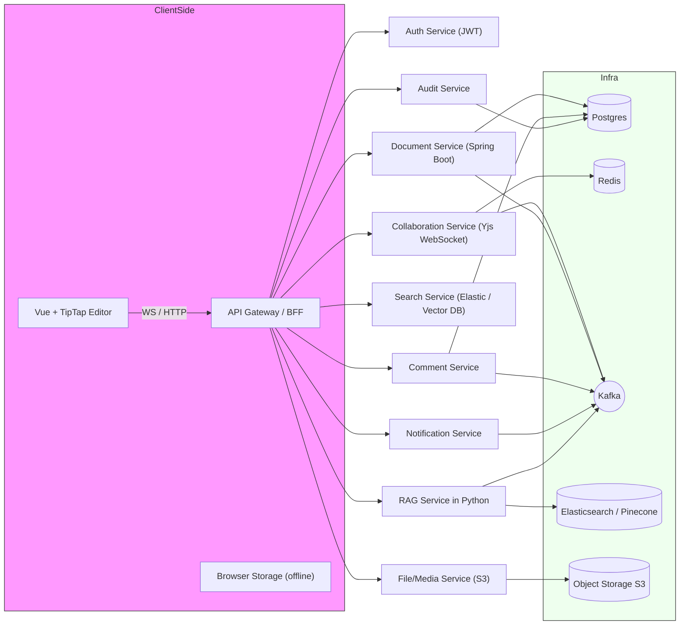
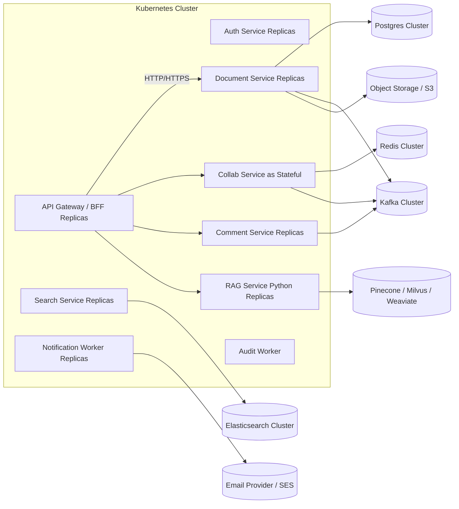
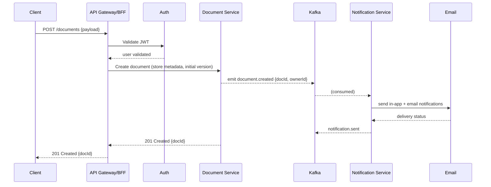
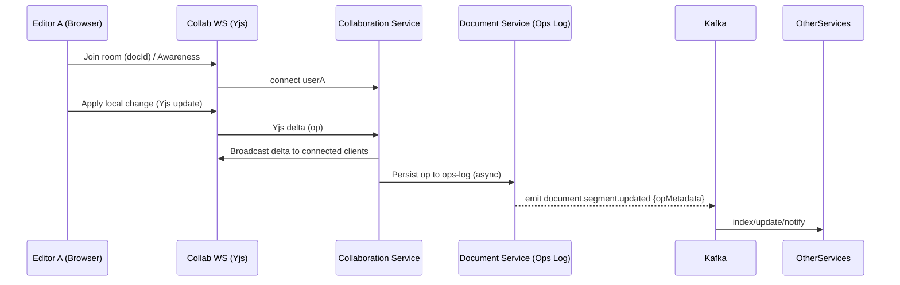
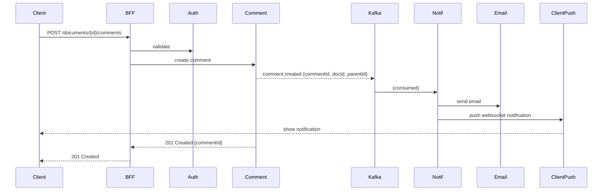
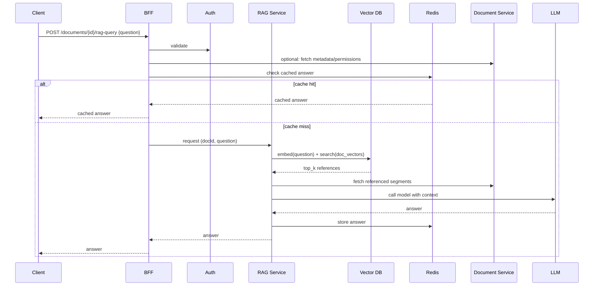

# High level system architecture

---
# Deployment/ Runtime view

# Sequence Diagram — Create Document & Notify

---

# Sequence Diagram — Real-time Collaboration (Edit flow using CRDT/Yjs)

# Sequence Diagram — Commenting → Notification → In-app & Email

# Sequence Diagram — RAG Query (Ask about Document)

